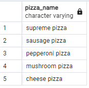
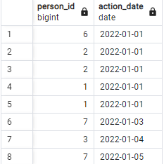
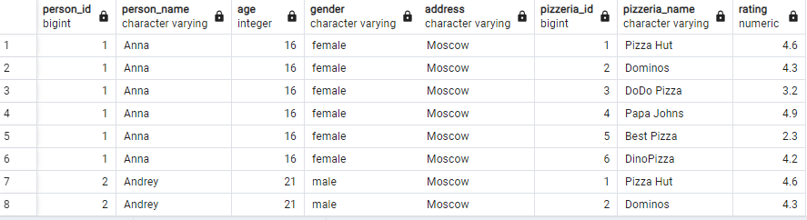
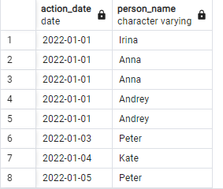
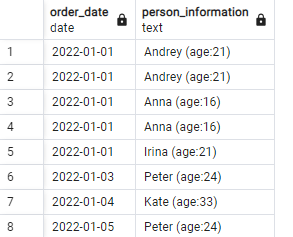
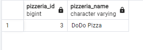
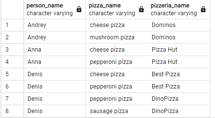

# Day 01 - Piscine SQL

## Exercise 00 - Let’s make UNION dance

Please write a SQL statement which returns menu’s identifier and pizza names from `menu` table and person’s identifier and person name from `person` table in one global list (with column names as presented on a sample below) ordered by object_id and then by object_name columns.

'''sql
SELECT 
    m.id AS object_id, 
    m.pizza_name AS object_name, 
    p.id AS person_id, 
    p.name AS person_name
FROM 
    menu m
JOIN 
    person p ON m.pizzeria_id = p.id
ORDER BY 
    object_id, 
    object_name;
'''
    

## Exercise 01 - UNION dance with subquery

Please modify a SQL statement from “exercise 00” by removing the object_id column. Then change ordering by object_name for part of data from the `person` table and then from `menu` table (like presented on a sample below). Please save duplicates!

'''sql
SELECT 
    p.id AS person_id, 
    p.name AS person_name,
    NULL AS object_name
FROM 
    person p

UNION ALL

SELECT 
    NULL AS person_id, 
    NULL AS person_name,
    m.pizza_name AS object_name
FROM 
    menu m

ORDER BY 
    person_name, object_name;
'''
    

## Exercise 02 - Duplicates or not duplicates

Please write a SQL statement which returns unique pizza names from the `menu` table and orders them by pizza_name column in descending mode. Please pay attention to the Denied section.

'''sql
SELECT DISTINCT pizza_name
FROM menu
ORDER BY pizza_name DESC;
'''

## Exercise 03 - “Hidden” Insights

Please write a SQL statement which returns common rows for attributes order_date, person_id from `person_order` table from one side and visit_date, person_id from `person_visits` table from the other side (please see a sample below). In other words, let’s find identifiers of persons, who visited and ordered some pizza on the same day. Actually, please add ordering by action_date in ascending mode and then by person_id in descending mode.

'''sql
SELECT 
    po.person_id,
    po.order_date AS action_date
FROM 
    person_order po
JOIN 
    person_visits pv ON po.order_date = pv.visit_date AND po.person_id = pv.person_id
ORDER BY 
    action_date ASC,
    po.person_id DESC;
'''
    

## Exercise 04 - Difference? Yep, let's find the difference between multisets.

Please write a SQL statement which returns a difference (minus) of person_id column values with saving duplicates between `person_order` table and `person_visits` table for order_date and visit_date are for 7th of January of 2022

'''sql
SELECT person_id
FROM person_order
WHERE order_date = '2022-01-07'

UNION ALL

SELECT person_id
FROM person_visits
WHERE visit_date = '2022-01-07'

EXCEPT

SELECT person_id
FROM person_order
WHERE order_date = '2022-01-07' 
AND person_id IN (
    SELECT person_id
    FROM person_visits
    WHERE visit_date = '2022-01-07'
);
'''

## Exercise 05 - Did you hear about Cartesian Product?

Please write a SQL statement which returns all possible combinations between `person` and `pizzeria` tables and please set ordering by person identifier and then by pizzeria identifier columns. Please take a look at the result sample below. Please be aware column's names can be different for you.

'''sql
SELECT person.id AS person_id,
       person.name AS person_name,
       person.age,
       person.gender,
       person.address,
       pizzeria.id AS pizzeria_id,
       pizzeria.name AS pizzeria_name,
       pizzeria.rating
FROM person
JOIN pizzeria ON 1=1
ORDER BY person.id, pizzeria.id;
'''

## Exercise 06 - Lets see on “Hidden” Insights

Let's return our mind back to exercise #03 and change our SQL statement to return person names instead of person identifiers and change ordering by action_date in ascending mode and then by person_name in descending mode. Please take a look at a data sample below.

'''sql
SELECT po.order_date AS action_date,
       p.name AS person_name
FROM person_order po
JOIN person p ON po.person_id = p.id
ORDER BY po.order_date ASC, p.name DESC;
'''

## Exercise 07 - Just make a JOIN

Please write a SQL statement which returns the date of order from the `person_order` table and corresponding person name (name and age are formatted as in the data sample below) which made an order from the `person` table. Add a sort by both columns in ascending mode.

'''sql
SELECT po.order_date AS order_date,
       CONCAT(p.name, ' (age:', p.age, ')') AS person_information
FROM person_order po
JOIN person p ON po.person_id = p.id
ORDER BY po.order_date ASC, p.name ASC;
'''

## Exercise 08 - Migrate JOIN to NATURAL JOIN

Please rewrite a SQL statement from exercise #07 by using NATURAL JOIN construction. The result must be the same like for exercise #07. 

'''sql
SELECT 
    po.order_date AS order_date,
    CONCAT(p.name, ' (', p.age, ')') AS person_details
FROM 
    person_order po
NATURAL JOIN 
    person p
ORDER BY 
    po.order_date ASC, 
    person_details ASC;
'''
    

## Exercise 09 - IN versus EXISTS

Please write 2 SQL statements which return a list of pizzerias names which have not been visited by persons by using IN for 1st one and EXISTS for the 2nd one.

'''sql
SELECT 
    p.name AS pizzeria_name
FROM 
    pizzeria p
WHERE 
    NOT EXISTS (SELECT 1 FROM person_visits pv WHERE pv.pizzeria_id = p.id);
'''
    
'''sql
SELECT 
    id AS pizzeria_id, 
    name AS pizzeria_name
FROM 
    pizzeria p
WHERE 
    NOT EXISTS (
        SELECT 
            1 
        FROM 
            person_visits pv 
        WHERE 
            pv.pizzeria_id = p.id
    );
'''    
  

## Exercise 10 - Global JOIN

Please write a SQL statement which returns a list of the person names which made an order for pizza in the corresponding pizzeria. 
The sample result (with named columns) is provided below and yes ... please make ordering by 3 columns (`person_name`, `pizza_name`, `pizzeria_name`) in ascending mode.

'''sql
SELECT 
    p.name AS person_name,
    m.pizza_name,
    pi.name AS pizzeria_name
FROM 
    person_order po
JOIN 
    person p ON po.person_id = p.id
JOIN 
    menu m ON po.menu_id = m.id
JOIN 
    pizzeria pi ON m.pizzeria_id = pi.id
ORDER BY 
    person_name ASC, 
    pizza_name ASC, 
    pizzeria_name ASC;
'''
    
